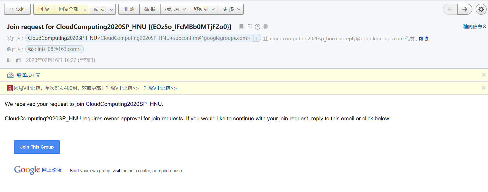
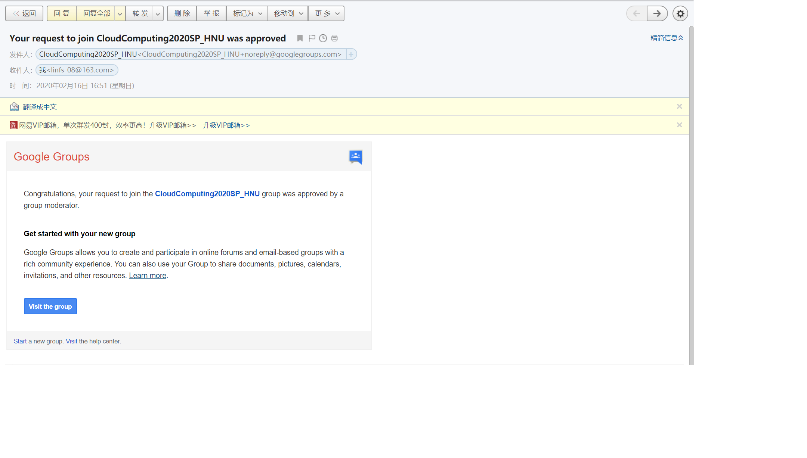

# How to join *CloudComputing2020SP_HNU* forum

### step 1. Send an email (content unlimited) to ***CloudComputing2020SP_HNU+subscribe@googlegroups.com***.

### step 2. Reply the email (content unlimited) that you will receive immediately. 

**[Description of step 2]:** If you have finished step 1, you will receive an email in a few seconds. This email looks like this:

This email is to confirm if you want to continue with your join request. Then, you should reply to this email or click on the *Join This Group* link as shows below. 

We suggest you to choose the first way (i.e. reply this email). If your choose the latter approach (i.e. click on the *Join This Group* link). You may get an error message like this: 

So, please choose the first way.

---

**All you need to do are the two steps above. Then, wait for the moderator to approve your request.**

Once the moderator approve your request, you will receive a *request-approved* email (show as below). 

***Now, you have joined *CloudComputing2020SP_HNU* forum. please enjoy !!!***